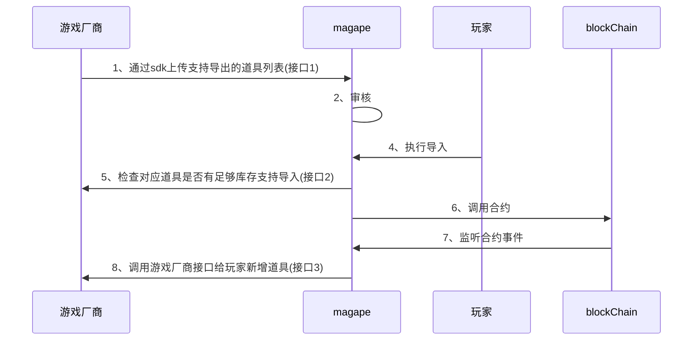
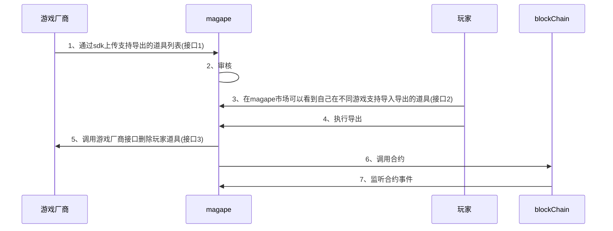
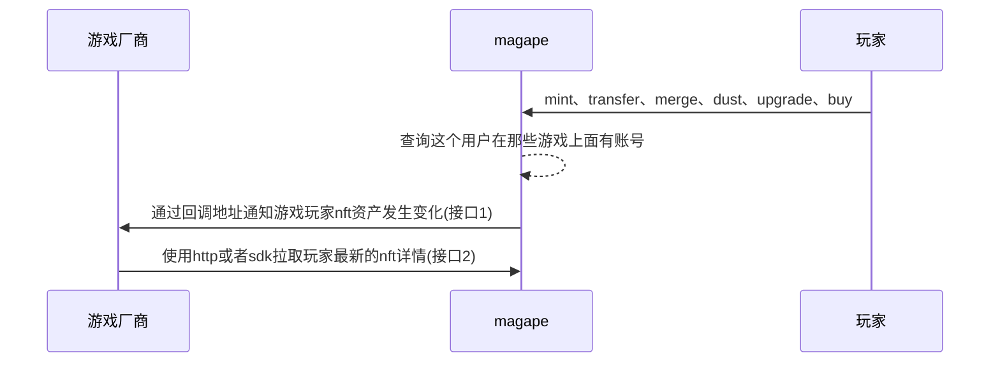

# 1、 游戏接入

# 2、使用SDK和magape平台进行交互
[https://github.com/magape-official/sdk/blob/main/java/JAVA_SDK_EN.md](https://github.com/magape-official/sdk/blob/main/java/JAVA_SDK_EN.md)

# 3、游戏道具与ERC20代币转换
## 3.1、erc20代币 -> 游戏道具

接口1: - [上传可导出道具元数据](java/HTTP_EN.md#2uploadorupdateprop)

接口2: - [检查游戏对应道具库存](#3315检查是否还有库存支持导入用于链数据到游戏道具功能)

接口3: - [在游戏中新增玩家道具](#3316新增玩家道具用于链数据游戏道具功能)


## 3.2、游戏道具 -> erc20代币

接口1: - [上传可导出道具元数据](java/HTTP_EN.md#2-uploadorupdateprop)

接口2: - [查询玩家可导出数量](#3311根据玩家钱包地址查询玩家支持导出的道具数量支持导出的道具由游戏方决定通过sdk上传到magape平台)

接口3: - [删除玩家道具](#3314删除玩家道具用于游戏道具到链数据功能)

## 3.3、需要提供的接口
### 3.3.1、游戏方
#### 3.3.1.1、根据玩家钱包地址查询玩家支持导出的道具数量，支持导出的道具由游戏方决定，通过sdk上传到magape平台
```http
# 请求
POST https://game.com/exportableAsset?address=xxx
--header 'Content-Type: application/json' \
--header 'signature:xxxx' 
--data '{
"reqId":'xxxx',
"address':'xxxx'
}'

# 返回
{
"code":200,
"data":[ 
    {
      "id":"游戏道具id",
      "value":10 
    }
  ],
  "err":"" 
}
```
**request**

|  | 类型 | 位置 | 描述 | 是否必填 |
| --- | --- | --- | --- | --- |
| header | signature | header | 请求签名，游戏平台使用私钥解签 | 是 |
| Content-Type | string | header | 请求类型application/json | 是 |
| reqId | string | body | 本次请求的唯一id | 是 |
| address | string | body | 游戏地址 | 是 |

**response**

|  | 类型 | 描述 | 是否必填 |
| --- | --- | --- | --- |
| code | int | 相应码,200 成功，401 未授权，500 错误 | 是 |
| err | string | 错误信息，有则不用填 | 
| data | array | 玩家可导出的道具合集 | 是 |
| data[0].id | string | 游戏道具id | 是 |
| data[0].value | int | 游戏中可导出道具的数量 | 是 |


#### 3.3.1.2、删除玩家道具，用于游戏道具到链数据功能
```http
# 请求
POST https://game.com/deleteAsset
--header 'signature:xxxx'
--header 'Content-Type: application/json' \
--data '{
    "reqId":"xxx",
    "address": xxxx,
    "assets":[
      {
      "propId": "游戏道具id", 
      "quantity": 10
      }
    ]
}'

# 返回
{
"code":200｜400｜401｜500 // 返回状态码
"data":"success" | "fail",
"err":"" 
}
```
**request**

|  | 类型 | 位置 | 描述 | 是否必填 |
| --- | --- | --- | --- | --- |
| signature | string | header | 请求签名，游戏平台使用私钥解签 | 是 |
| Content-Type | string | header | 请求类型application/json | 是 |
| reqId | string | body | 本次请求的唯一id | 是 |
| address | string | body | 玩家地址 | 是 |
| assets | array | body | 受影响的资产 | 是 |
| assets[].propId | string | body | 游戏道具id | 是 |
| assets[].quantity | int | body | 要删除的数量 | 是 |

**response**

|  | 类型 | 描述 | 是否必填 |
| --- | --- | --- | --- |
| code | int | 相应码,200 成功，401 未授权，500 错误 | 是 |
| err | string | 错误信息，有则不用填 | 否 |
| data | string | "success" &#124; "fail | 是 |

#### 3.3.1.5、检查是否还有库存支持导入，用于链数据到游戏道具功能
```http
# 请求
POST https://game.com/checkStorage
--header 'signature:xxxx' 
--header 'Content-Type: application/json' \
--data '{
    "reqId":"xxx",
    "address": xxxx,
    "assets":[
      {
      "propId": "游戏道具id", 
      "quantity": 10
      }
    ]
}'

# 返回
{
"code":200,
"data":{
    "enough":true,
    "remainStore":100
 },
"err":""
}
```

**request**

|  | 类型 | 位置 | 描述 | 是否必填 |
| --- | --- | --- | --- | --- |
| signature | string | header | 请求签名，游戏平台使用私钥解签 | 是 |
| Content-Type | string | header | 请求类型application/json | 是 |
| reqId | string | body | 本次请求的唯一id | 是 |
| address | string | body | 玩家地址 | 否(查询游戏整体库存则不传，查询玩家库存的时候传玩家地址) |
| assets | array | body | 受影响的资产 | 是 |
| assets[].propId | string | body | 游戏道具id | 是 |
| assets[].quantity | int | body | 要购买的数量 | 是 |

**response**

|  | 类型 | 描述 | 是否必填 |
| --- | --- | --- | --- |
| code | int | 相应码,200 成功，401 未授权，500 错误 | 是 |
| err | string | 错误信息，有则不用填 | 否 |
| data | string | "success" &#124; "fail | 是 |

#### 

#### 3.3.1.6、新增玩家道具，用于链数据游戏道具功能
```http
# 请求
POST https://game.com/increaseAsset
--header 'signature:xxxx'
--header 'Content-Type: application/json' \
--data '{
    "reqId":"xxx", 
    "address": xxxx,
    "assets":[
      {
      "propId": "游戏道具id", 
      "quantity": 10
      }
    ]
}'

# 返回
{
"code":200,
"data":"success" ,
"err":""
}
```
**request**

|  | 类型 | 位置 | 描述 | 是否必填 |
| --- | --- | --- | --- | --- |
| signature | string | header | 请求签名，游戏平台使用私钥解签 | 是 |
| Content-Type | string | header | 请求类型application/json | 是 |
| reqId | string | body | 本次请求的唯一id | 是 |
| address | string | body | 玩家地址 | 是 |
| assets | array | body | 受影响的资产 | 是 |
| assets[].propId | string | body | 游戏道具id | 是 |
| assets[].quantity | int | body | 要删除的数量 | 是 |

**response**

|  | 类型 | 描述 | 是否必填 |
| --- | --- | --- | --- |
| code | int | 相应码,200 成功，401 未授权，500 错误 | 是 |
| err | string | 错误信息，有则不用填 | 否 |
| data | string | "success" &#124; "fail | 是 |

#### 

### 3.3.2、magape平台
#### 3.3.2.1、上传游戏可导出道具元数据
#### [https://github.com/magape-official/sdk/blob/main/java/HTTP_EN.md](https://github.com/magape-official/sdk/blob/main/java/HTTP_EN.md)（参考uploadOrUpdateProp方法）
# 4、NFT变动

接口1: - [提醒游戏用户nft发生变化](#4111接受magape-nft变更的回调函数用户在nft变更minttransfer会通知游戏方游戏方调用magape接口拉取最新的nft列表)

接口2: - [获取用户所有nft](java/HTTP_EN.md#1getpoplist)

## 4.1、需要提供的接口
### 4.1.1、游戏方
#### 4.1.1.1、接受magape nft变更的回调函数。用户在nft变更(mint、transfer...)会通知游戏方。游戏方调用magape接口拉取最新的nft列表
```http
# 请求
POST https://game.com/nftNotify
--header 'Content-Type: application/json' \
--header 'signature:xxxx' 
--data '{
"reqId":'xxxx',
"address':'xxxx'
}'
# 返回
{
"code":200,
"data":"success",
"err":""
}
```
**request**

|  | 类型 | 位置 | 描述 | 是否必填 |
| --- | --- | --- | --- | --- |
| signature | string | header | 请求签名，游戏平台使用私钥解签 | 是 |
| Content-Type | string | header | 请求类型 | 是 |
| reqId | string | body | 本次请求唯一id | 是 |
| address | string | body | 玩家地址 | 是 |

**response**

|  | 类型 | 描述 | 是否必填 |
| --- | --- | --- | --- |
| code | int | 相应码,200 成功，401 未授权，500 错误 | 是 |
| err | string | 错误信息，有则不用填 | 否 |
| data | string | "success" &#124; "fail | 是 |

#### 

### 4.1.2、magape
#### 4.1.2.1、根据玩家地址查询所有nft列表，sdk中getPopList函数，返回的NFT属性为A(1-10)、B(1-10)、C(1-10)、D(1-10),属性在5、NFT在游戏中的影响中有详细描述
```java
{
  "code": 200,
  "data": {
    "data": [
      {
        "attrList": [
          {
            "displayType": "boost_percentage", // 不需要处理，属于nft market市场展示
            "traitType": "D2", // 属性名
            "value": 60 // 属性值，百分比
          },
          {
            "displayType": "boost_percentage",
            "traitType": "D1",
            "value": 20
          },
          {
            "displayType": "boost_percentage",
            "traitType": "D9",
            "value": 30
          },
          {
            "displayType": "boost_percentage",
            "traitType": "D5",
            "value": 40
          },
          {
            "traitType": "Rank",
            "value": "Epic"
          },
          {
            "traitType": "Ape Type",
            "value": "Sky"
          }
        ],
        "attrs": "[{\"display_type\":\"boost_percentage\",\"trait_type\":\"D2\",\"value\":60},{\"display_type\":\"boost_percentage\",\"trait_type\":\"D1\",\"value\":20},{\"display_type\":\"boost_percentage\",\"trait_type\":\"D9\",\"value\":30},{\"display_type\":\"boost_percentage\",\"trait_type\":\"D5\",\"value\":40},{\"trait_type\":\"Rank\",\"value\":\"Epic\"},{\"trait_type\":\"Ape Type\",\"value\":\"Sky\"}]",
        "category": "Sky",
        "createTime": 1714109254000,
        "erc721ContractAddress": "0x3FB236F17054c24DB20FDf6135Ce334DE7451928",
        "fromAddress": "0x0000000000000000000000000000000000000000",
        "imageUrl": "https://testnet-api.magape.io/ipfs/QmeSRVY7786EZTEQivowaPakjjSPg3BRyMdWk8dHWroDFL",
        "imgCid": "ipfs://QmeSRVY7786EZTEQivowaPakjjSPg3BRyMdWk8dHWroDFL",
        "level": "Epic",
        "name": "Mappy #306",
        "nftCidUrl": "https://testnet-api.magape.io/ipns/null",
        "status": 2,
        "toAddress": "0x4d11df920e0e48c7e132e5a9754c7e754cd6ebfb",
        "tokenId": 306
      }
    ],
    "hasNext": true,
    "pageNo": 1,
    "pageSize": 20,
    "totalPage": 2,
    "totalRecord": 38
  },
  "message": "success"
}
```
## 4.2、安全问题
4.2.1、游戏厂商在生成sk的时候，magape平台会同步生成一个公钥，在magape给游戏厂商发送数据时会对数据进行加密，游戏方拿到数据之后可以通过sk进行解密。避免接口暴露导致恶意攻击
```java
InputStream inputStream = request.getInputStream();
ByteArrayOutputStream output = new ByteArrayOutputStream();
byte[] buffer = new byte[1024];
int n;
while (-1 != (n = inputStream.read(buffer))) {
   output.write(buffer, 0, n);
}
String payload = output.toString(StandardCharsets.UTF_8);
String sigHeader = request.getHeader("signature");
String accessKeyStr = "magape平台公钥";

byte[] accessKeyBytes = Base64.decodeBase64(accessKeyStr);
X509EncodedKeySpec keySpec = new X509EncodedKeySpec(accessKeyBytes);
KeyFactory keyFactory = KeyFactory.getInstance("Ed25519");
PublicKey accessKey = keyFactory.generatePublic(keySpec);

Signature signDecode = Signature.getInstance("Ed25519");
signDecode.initVerify(accessKey);
signDecode.update(source.getBytes(StandardCharsets.UTF_8));
boolean verifyResult = signDecode.verify(Base64.decodeBase64(rsaData));

System.out.println("Verify Result: " + verifyResult);
```
# 5、NFT在游戏中的影响
在magape页面设置游戏支持的nft类型，目前分为4类"City", "Jungle", “Ocean", "Sky",每一种类型下面有不同的属性。
游戏厂商可以选择任意一种类型的nft进行游戏人物增强，每一个nft的属性只会属于其中一种类型，比如NFT不会同时拥有City下面的属性和Jungle下面的属性

游戏方可以自行设定游戏功能使用哪一种属性（例如：攻击力 -> City的A1），并设置在游戏中影响的最大值和最小值

nft等级决定了具体影响数值。目前magape的nft有5个等级（Common、Uncommon、Rare、Epic、Legendary）

magape平台可以提供接口计算这些NFT最终加成，游戏平台也可以获取所有的NFT自行计算这些属性加成
## 5.1、需要提供的接口
### 5.1.1、游戏方
5.1.1.1、获取游戏支持的属性，方便玩家可以准确的知道自己拥有的nft能对游戏的加成
```http
# 请求
POST https://game.com/attrDefinition
--header 'Content-Type: application/json' \
--header 'signature:xxxx' \
--data '{
"reqId":"xxxxx"
}'

# 返回
{
  "code":200
  "data": {
    "category": "City",
    "attrs": [
      {
        "attr":"A1",
        "min":10,
        "max":100,
        "description":"Power Enhancement"
      }
    ]
  },
  "err":"" 
}
```


**request**

|  | 类型 | 位置 | 描述 | 是否必填 |
| --- | --- | --- | --- | --- |
| signature | string | header | 请求签名，游戏平台使用私钥解签 | 是 |
| Content-Type | string | header | 请求类型 | 
 |
| reqId | string | body | 本次请求唯一id | 
 |

**response**

|  | 类型 | 描述 | 是否必填 |
| --- | --- | --- | --- |
| code | int | 相应码,200 成功，401 未授权，500 错误 | 是 |
| err | string | 错误信息，有则不用填 | 否 |
| category | string | 游戏支持的nft类型（City, Jungle, Ocean, Sky） | 是 |
| attrs | array | 游戏支持的属性 | 是 |
| attrs[0].attr | string | 属性名称 | 是 |
| attrs[0].min | int | 属性最小值，百分比 | 是 |
| attrs[0].max | int | 属性最大值，百分比 | 是 |
| attrs[0].description | string | 属性描述 | 是 |


### 5.1.2、magape
5.1.1.2.1、游戏获取用户所有nft总的加成，算法参考上述表格
```http
# 请求
curl --location 'https://{url}/api/v1/nft/overallPerformance' \
        --header 'signature: xxxx' \
        --header 'requestId: 123123127' \
        --header 'X-Access-Key: xxx' \
        --header 'Content-Type: application/json' \
        --data '
            {
                "address":"xxxx",
                "networkId":56
            }
'

# 返回
{
  "code": 200,
  "data": {
    "enhancedAttrs": [
      {
        "enhancedPercentage": "80",// nft enhanced percentage 80%
        "enhancedVal": 16.84,// the value that calculated according to configuretion in magape platform
        "id": 6,
        "level": "Common", // nft level   
        "name": "A6",// game define attribute
        "nfName": "Mappy #106" // the NFT that provide this capability
      }
    ]
  },
  "message": "success"
}
```
**request**

|  |位置 | 描述 | 是否必填 |
| ---  | --- | --- | --- |
| requestId                | header      | Unique traceId, cannot be repeated                 | Yes      |
| signature                | header      | Signature information                              | Yes      |
| X-Access-Key             | header      | Game merchants' access keys on the magape platform | Yes      |
| NFTOverallPerformanceReq | body        | request   param                                    | Yes      |


|           | 类型     | 描述                                   | Required |
|-----------|--------|--------------------------------------|----------|
| networkId | int    | networkId(97 bsc testnet,56 mainnet) | yes      |
| address   | string | Gamer's address                      | yes      |


**response**

|                                     | 类型 | 描述                        | 是否必填 |
|-------------------------------------| --- |---------------------------| --- |
| code                                | int | 相应码,200 成功，401 未授权，500 错误 | 是 |
| err                                 | string | 错误信息，有则不用填                | 否 |
| address                             | string | 玩家地址                      | 是 |
| enhancedAttrs                       | array | 增益                        | 是 |
| enhancedAttrs[0].enhancedPercentage | string | 属性增幅比例                    | 是 |
| enhancedAttrs[0].enhancedVal        | int | 属性加成值                     | 是 |
| enhancedAttrs[0].id                 | int | 属性id                      | 是 |
| enhancedAttrs[0].level                | int | nft 等级                    | 是 |
| enhancedAttrs[0].name                | int | 游戏定义属性                    | 是 |
| enhancedAttrs[0].nfName                | int | nft 名称                    | 是 |


# 6、登入游戏
## 6.1、web游戏通过magape登入
玩家先登入magape平台进行签名，在进入游戏的时候带上magape平台生成的token信息。游戏厂商可以直接使用token操作sdk方法，也可以直接传入玩家地址，区别是token可以让玩家退出游戏，address不存在退出
## 6.2、通过游戏自身的账户体系登入
游戏需要提供入口让玩家和钱包地址进行绑定，绑定之后在调用magape平台接口时会自动在magape平台中保存玩家和游戏的关联关系


# 7、悬浮图标功能
## 7.1、登入注册
### 7.1.1、登入
通过本地钱包执行登入验证签名，或者输入设置好的密码执行登入，调用签名访问进行认证授权。返回认证结果和用户钱包地址
### 7.1.2、注册
通过开源钱包或者magape随机生成一个钱包公私钥，并让用户设定好密码。返回认证结果和用户钱包地址
## 7.2、退出
## 7.3、资产查询
可以查询用户所有的nft，以及代币余额
## 7.4、支付
